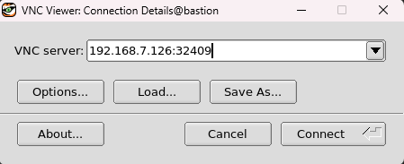
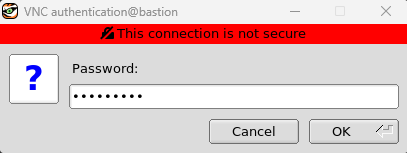
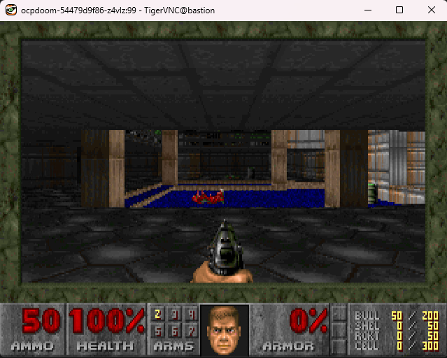
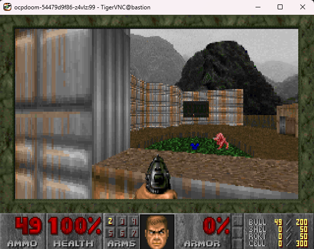

# DOOM on OpenShift

[OpenShift Container Platform (OCP)](https://www.openshift.com) is capable of building and hosting applications. This includes old retro video games. One of the oldest and most popular retro FPS games [DOOM](https://en.wikipedia.org/wiki/Doom_(1993_video_game)) released in 1993 has been containerized and brought into Kubernetes via a culmination of projects ending up in one called [kubedoom](https://github.com/storax/kubedoom). Like DOOM, [Red Hat](https://www.redhat.com) the home of OpenShift has also been around since [1993](https://www.redhat.com/en/blog/red-hatters-30-years-innovation-collaboration-and-community). So for this exercise I thought it would be cool bring their legacy together into a contemporary [Fedora](https://getfedora.org/) based image and run it on OpenShift. We’ll call this fork [ocpdoom](https://github.com/OpenShiftDemos/ocpdoom).

<br>

## Prerequisites

This requires you have a working instance of OpenShift 4 running before continuing. That could be any of the multitude of variants of OpenShift that are available to be utilized in just about any situation:

* [OpenShift On-prem](https://docs.openshift.com/container-platform/4.12/installing/installing_on_prem_assisted/installing-on-prem-assisted.html) (Bare Metal, Red Hat Virtualization, VMware, OpenStack)
* OpenShift on the Cloud: [AWS](https://aws.amazon.com/rosa/), [Azure](https://azure.microsoft.com/en-us/products/openshift), [Google Cloud](https://console.cloud.google.com/marketplace/browse?q=red%20hat%20openshift&pli=1), [IBM Cloud](https://www.ibm.com/cloud/openshift)
* [Microshift](https://github.com/openshift/microshift)
* [OpenShift Local](https://developers.redhat.com/products/openshift-local/overview)

Note that for this particular example you’ll need access to the [cluster-admin cluster role](https://docs.openshift.com/container-platform/4.12/authentication/using-rbac.html#:~:text=Cluster%20administrators%20can%20use%20the,has%20access%20to%20their%20projects.) which will give you the ability manipulate permissions as needed. For that you will need full control of your OpenShift cluster. In addition, you will also need access to the [OpenShift Command Line Interface](https://docs.openshift.com/container-platform/4.12/cli_reference/openshift_cli/getting-started-cli.html) or “`oc`” tool.

<br>

## Building and Deploying DOOM

Once you’re logged into your OpenShift cluster using `oc` the process of building and deploying the "ocpdoom” image is made very simple.

1. Create some OpenShift Projects in which DOOM and it’s monsters will reside by running the following command from a terminal shell:

```bash
oc new-project monsters
oc new-project ocpdoom
```

2. We will now create a service account named `doomguy`, create a cluster role named `monster-control` and assign it to him:

```bash
oc create serviceaccount doomguy -n ocpdoom
oc create clusterrole monster-control --verb=get,list,watch,kill --resource=pods
oc adm policy add-cluster-role-to-user monster-control -z doomguy -n ocpdoom
```

3. Create the ocpdoom application and build the image from source using [oc new-app](https://docs.openshift.com/container-platform/latest/applications/creating_applications/creating-applications-using-cli.html).

```bash
oc new-app https://github.com/OpenShiftDemos/ocpdoom.git --name=ocpdoom -n ocpdoom
```
If you would like to see the build in progress:
```bash
oc logs bc/ocpdoom -f -n ocpdoom
```

The above `oc new-app` command did several things.
* Constructed and created a [Deployment](https://docs.openshift.com/container-platform/latest/applications/deployments/what-deployments-are.html) based on the contents in the specified Github repo.
* Spun up a build pod and built the ocpdoom image and then pushed it into the native OpenShift image registry
* Finally it attempts to deploy the image once it's present in the openshift registry. 

Once the build is complete and the container is deployed you should see an output similar to this:

```bash
oc get pods -n ocpdoom
```

```console
NAME                       READY   STATUS      RESTARTS      AGE
ocpdoom-1-build            0/1     Completed   0             32m
ocpdoom-69c578bf87-4mjvx   0/1     Error       2 (28s ago)   117s
```
But why is the pod reporting an `Error` state!? Let's investigate with [oc logs](https://docs.openshift.com/container-platform/latest/logging/viewing-resource-logs.html):

```bash
oc logs -l deployment=ocpdoom -n ocpdoom
```
```console
Error from server (Forbidden): pods is forbidden: User "system:serviceaccount:ocpdoom:default" cannot list resource "pods" in API group "" at the cluster scope
2023/03/28 14:50:09 The following command failed: "[kubectl get pods -A -o go-template --template={{range .items}}{{.metadata.namespace}}/{{.metadata.name}} {{end}}]"
```

It's because `ocpdoom` is trying to get a list of all pods in all namespaces. OpenShift restricts project to project/namespace to namespace interaction out of the box. Here's where the `doomguy` service account with his cluster role `monster-control` come in.

Let's assign the newly created deployment the `doomguy` service account:
```bash
oc set serviceaccount deployment ocpdoom doomguy -n ocpdoom
```
We can also narrow down the scope of where we want ocpdoom to focus by setting the `NAMESPACE` environment variable in the deployment:

```bash
oc set env deployment ocpdoom NAMESPACE=monsters
```

Now check to see if your application pod is in a READY and Running state:

```bash
oc get pods -n ocpdoom
```

You should get an output similar to this:

```console
NAME                       READY   STATUS      RESTARTS   AGE
ocpdoom-1-build            0/1     Completed   0          44m
ocpdoom-74d97f4fbd-2h85d   1/1     Running     0          6s
```

<br>

## Monsters!

You’re going to need some monsters. Or pods represented as [Demons](https://doom.fandom.com/wiki/Demon) in this case. You’ll do this by deploying a simple little container:


```bash
oc new-app https://github.com/OpenShiftDemos/monster.git --name=monster -n monsters
```

Observe the build progress:
```
oc logs bc/monster -f -n monsters
```

```bash
oc get pods -n monsters
```
With an output similar to this:
```console
NAME                       READY   STATUS      RESTARTS   AGE
monster-1-build            0/1     Completed   0          4m46s
monster-5cf6c54d68-w6ctj   1/1     Running     0          64s
```

Optionally you can use [oc scale](https://docs.openshift.com/container-platform/latest/cli_reference/openshift_cli/developer-cli-commands.html#oc-scale) to adjust the amount of monsters you would like:
```bash
oc scale deployment monster --replicas=2 -n monsters
```
```console
NAME                       READY   STATUS      RESTARTS   AGE
monster-1-build            0/1     Completed   0          7m9s
monster-5cf6c54d68-4pwrx   1/1     Running     0          6s
monster-5cf6c54d68-w6ctj   1/1     Running     0          3m27s
```

<br>

## Exposing DOOM

In order for us to access DOOM from outside of OpenShift we’re going to create a Kubernetes [service](https://docs.openshift.com/container-platform/latest/rest_api/network_apis/service-v1.html) using the [oc expose](https://docs.openshift.com/container-platform/4.12/cli_reference/openshift_cli/developer-cli-commands.html#oc-expose) command:

```bash
oc expose deployment/ocpdoom --port 5900 -n ocpdoom
```

Then we'll open up a connection to that service over the default VNC port (TCP/5900) we exposed using the [oc port-forward](https://docs.openshift.com/container-platform/4.12/nodes/containers/nodes-containers-port-forwarding.html):

```bash
oc port-forward deployment/ocpdoom 5900:5900 -n ocpdoom
```

Leave that connection up and running in the background and move on to the next section.

<br>

## Connecting to DOOM

The `ocpdoom` container houses X11 and VNC servers to display and connect to the game. In order to connect to DOOM you will need to download and install the TigerVNC `vncviewer` found [here](https://sourceforge.net/projects/tigervnc/files/stable/)

Once downloaded open up the `vncviewer` application and enter in `<ip address>:5900` where the ip address is the host in which you're port-forwarding from. But make sure there is no firewall blocking access to TCP/5900 in-between you and the bastion host. 

Or if the `oc port-forward` was issued from your localhost just use `localhost:5900` like so:


<br>

Example:



Click `Connect`

Enter Password "openshift" and click `OK`



<br>

## Welcome to DOOM

Congratulations! You’re now playing Doom in a container within a Kubernetes pod on the OpenShift Container Platform accessing it all through a vnc server using vncviewer. 

It should look something like this:



At this point you can run around and play the game using your keyboards `arrow keys` to move, `ctrl` shoot and `space bar` to open doors. 

Here’s where the monster pods come in. You’ll stumble upon an open field with monsters like this roaming around:



Those monsters represent the pods in your monsters namespace. If you shoot those monsters that kills them and the pod they represent. You can view this on the OpenShift side by opening up another terminal and running the following command:

```bash
watch oc get pods -n monsters
```

The monsters keep on respawing! Since `oc new-app` also created a Kubernetes [ReplicaSet](https://kubernetes.io/docs/concepts/workloads/controllers/replicaset/) it will respawn that missing pod monster even after being killed. So really the only way to get rid of all the monsters once and for all is through a non violent tactic via the command line. One way we can accomplish this is using the `oc scale` command:

```bash
oc scale deployment monster --replicas=0 -n monsters 
```

Once all the pods are [Terminated](https://kubernetes.io/docs/concepts/workloads/pods/pod-lifecycle/#container-state-terminated) all the active monsters in the field should vanish. But watch out there are other creatures lurking around! Enjoy :boom:

<br>

## Easy

You can see by this example how easy it is to build deploy legacy applications of all kinds with OpenShift. Hopefully you had fun in the process and found some inspiration. Visit [developers.redhat.com/learn](https://developers.redhat.com/learn) for more examples of using OpenShift and the wonderful echosystem that comes with it.

<br>

## Bonus

Enter the following codes while playing DOOM to unlock additional tricks:

* `idspispopd` - Let's you walk through walls. Get a little closer to the monsters!
* `idkfa` - Then press `5`. Use with caution!

